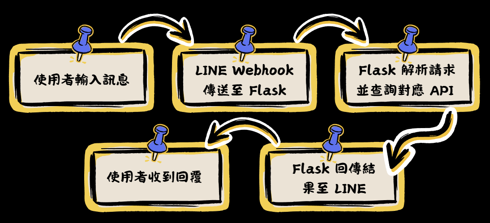

# 🍠 地瓜地瓜 – Smart Life Assistant (AIoT LINE Chatbot)

*A multi-function LINE-based smart assistant integrating restaurant recommendations, weather forecasting, calendar scheduling, translation, and daily fortune insights.*  
This project was developed as part of an AIoT coursework project and aims to simplify daily life by reducing app-switching and providing instant information through one single chat interface.

---

## 🌟 Overview

Modern smart assistants like Siri or Google Assistant often require manual activation and switching between multiple apps.  
**Digua Digua** solves this by integrating all daily-use functions into a single LINE chatbot interface.

Using APIs such as Google Maps, Google Calendar, Taiwan CWB Weather API, and Gemini AI, the bot provides:

- 🍽️ Restaurant recommendations based on real-time location  
- 📅 Calendar event search & creation  
- 🌤️ Weather forecasting  
- 🌍 Multilingual translation  
- 🔮 Daily fortune drawing  
- 📘 Answer Book / knowledge question responses  

---

## 🧱 System Architecture
```
LINE App → LINE Webhook → Flask Server (Ngrok Tunnel)
↓
External APIs (Google Maps / Calendar / Weather / Gemini)
```

### Components
- **Flask Server**  
  Handles webhook events, message parsing, API calls, and replies.  
- **Ngrok**  
  Converts localhost server into public HTTPS endpoint for LINE webhook validation.  
- **External APIs**  
  - Google Maps API – restaurant search  
  - Google Calendar API – event listing & creation  
  - Taiwan CWB Weather API – daily weather data  
  - Gemini API – translation & Q&A generation  

## 🔧 Implementation Features
### 🍽️ FoodieHunt – Restaurant Recommendation

Uses Google Maps Places API to find nearby high-rated restaurants based on user location.
Supports keyword filters (e.g., “ramen”, “dinner”).


### 📅 PlanPal – Google Calendar Assistant

“查行程” → Retrieves today’s events

“新增行程 + 內容” → Generates Google Calendar event creation link

Helps users avoid forgetting tasks or schedules


### 🌤️ SkyCast – Weather Forecast

Uses Taiwan’s CWB API to provide:

Temperature

Rain probability

UV index

Weather suggestion (e.g., bring umbrella!)


### 🌍 LingoGem – Multilingual Translation

Powered by Gemini AI API:

Detects natural language

Translates into Chinese, English, Japanese, etc.
Example: 「翻譯：我今天很開心，英文」
→ “I’m happy today.”


### 🔮 Daily Oracle – Daily Fortune

Randomly selects a fortune with visual presentation.
Example results: 吉 / 小吉 / 平


### 📘 Fortune Whisper – Answer Book / Q&A

Uses Gemini AI + custom dataset to provide:

Knowledge answers

Simple explanations

Random advice

Input examples:

“解答之書”

“為什麼會下雨？”


### 🗺️ Workflow
- User sends message in LINE
- LINE Webhook forwards event to Flask server
- Flask parses intent and calls appropriate API
- Flask returns results to LINE
- User receives formatted reply



### 👍 Advantages (Pros)

- Low entry barrier – no extra app needed

- High interactivity – instant responses

- Multi-feature integration – food, weather, schedules, translations

- Expandable – supports new AI models & features

- Cross-platform (LINE) – usable on mobile, tablet, desktop

### 👎 Limitations (Cons)

- LINE push messages require paid quota

- External API limits (Google, Gemini)

- OAuth2 integration complexity

- Desktop vs mobile UI inconsistency

- Ngrok dependency (until deployed to cloud)


### 🚀 Future Improvements

- Add user database to support personalized experience

- Link ordering systems (food delivery, hotel booking)

- Cloud deployment (already partially improved)

- Improve cross-device rendering consistency

### ✅ Conclusion
The Digua Digua Smart Assistant successfully integrates six core life functions into one LINE bot:

- Restaurant recommendations

- Calendar integration

- Weather forecast

- Translation

- Daily fortune

- Q&A knowledge features

Users can access all these via a single LINE window, making daily information retrieval faster and more intuitive.


---
# Contributors
- Hsu Ya-Chuan
- Hsu Hsuan-Kuang
- Lin Wen-Chen

