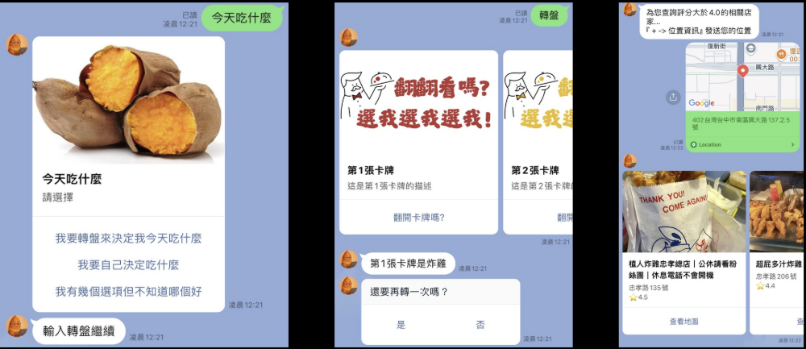
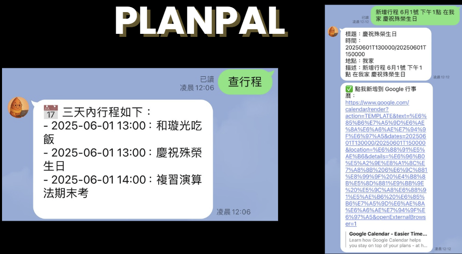
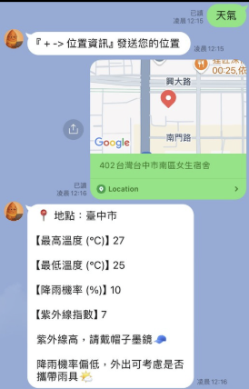
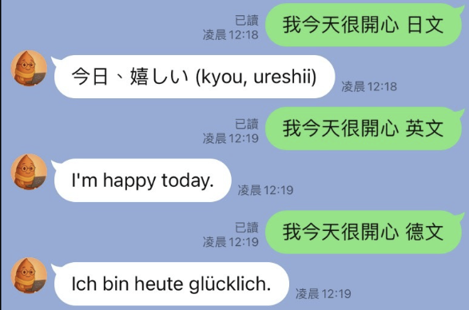
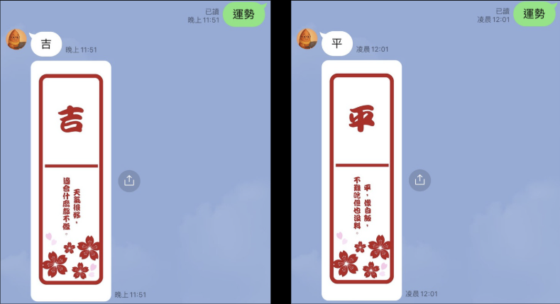
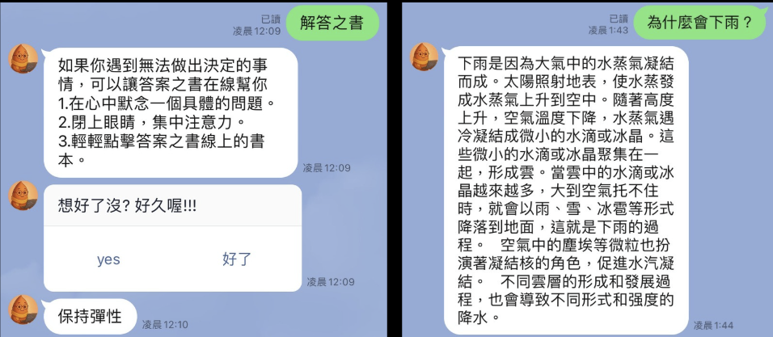

# 🍠 Digua Digua – Smart Life Assistant

A LINE-based smart assistant that integrates restaurant recommendations, calendar scheduling, weather forecasts, multilingual translation, daily fortune, and question answering into a single chat interface.

Developed as an AIoT course project, Digua Digua reduces the need to switch between multiple applications by connecting commonly used services through LINE.

---

## 🌟 Overview

Digua Digua provides six daily-life features directly through a LINE chatbot:

- 🍽️ **Restaurant Recommendations** – Find nearby restaurants based on the user's location
- 📅 **Calendar Assistant** – View and create Google Calendar events
- 🌤️ **Weather Forecast** – Retrieve daily weather information
- 🌍 **Multilingual Translation** – Translate text using Gemini
- 🔮 **Daily Fortune** – Generate a randomized daily fortune
- 📘 **Answer Book & Q&A** – Provide simple answers and advice using Gemini and custom data

The backend is built with **Python and Flask** and communicates with LINE through webhook events. It integrates Google Maps, Google Calendar, Taiwan weather data, and Gemini to process user requests and return responses in real time.

---

## 🛠️ Tech Stack

| Category | Technologies |
| --- | --- |
| **Backend** | Python, Flask |
| **Platform** | LINE Messaging API |
| **External APIs** | Google Maps API, Google Calendar API, Taiwan Weather API, Gemini API |
| **Authentication** | OAuth2 |
| **Deployment** | Vercel |
| **Development Tools** | Git, GitHub, Ngrok |

---

## 🧱 System Architecture

```text
                         User
                           │
                           ▼
                       LINE App
                           │
                           ▼
                     LINE Webhook
                           │
                           ▼
                    Flask Backend
                           │
          ┌────────────────┼────────────────┐
          │                │                │
          ▼                ▼                ▼
    Google Maps      Google Calendar    Weather API
          │                │
          │                ▼
          │              OAuth2
          │
          └────────────────┬────────────────┘
                           │
                           ▼
                       Gemini API
                           │
                           ▼
                    Response to LINE
```

During development, the Flask server was initially hosted locally and exposed through an **Ngrok HTTPS tunnel** so that LINE could send webhook events to the application.

The backend was later deployed on **Vercel**, removing the need to keep a local server running.

---

## 🔄 Request Workflow

The application uses a webhook-driven request flow:

1. The user sends a message or location through LINE.
2. LINE forwards the event to the Flask webhook endpoint.
3. The backend parses the incoming event and determines the requested feature.
4. Flask sends requests to the corresponding external API.
5. The backend processes and formats the returned data.
6. The response is sent back to the user through LINE.

```text
User Input
    │
    ▼
LINE Webhook
    │
    ▼
Flask Request Handler
    │
    ├── Restaurant ──► Google Maps API
    │
    ├── Calendar ────► Google Calendar API
    │
    ├── Weather ─────► Taiwan Weather API
    │
    └── Translation/Q&A ──► Gemini API
    │
    ▼
Format Response
    │
    ▼
LINE User
```

---

## ☁️ Deployment

The backend was originally run locally and exposed through an **Ngrok tunnel** during development.

It has since been deployed on **Vercel** for persistent webhook access.

### Continuous Deployment

The GitHub repository is connected directly to the Vercel project:

```text
Push to main
     │
     ▼
GitHub Repository
     │
     ▼
Vercel Build & Deployment
     │
     ▼
Updated Flask Backend
```

Every push to the `main` branch automatically triggers a new deployment on Vercel.

This removes the need to manually redeploy the application or keep a local Ngrok server running for the LINE webhook.

---

# ✨ Features

## 🍽️ FoodieHunt – Restaurant Recommendations

FoodieHunt uses the **Google Maps API** to search for nearby restaurants based on the user's location.

It can:

- Search for restaurants near the user
- Recommend highly rated restaurants
- Support food-related keywords
- Return restaurant names, addresses, and map information

Example requests include:

```text
晚餐
轉盤
```

<!-- Replace with your actual repository image -->


---

## 📅 PlanPal – Google Calendar Assistant

PlanPal integrates with the **Google Calendar API** to help users manage their schedules directly through LINE.

Users can:

- Retrieve events scheduled for the current day
- Create new calendar events
- Access event creation through natural-language commands

Example:

```text
查行程
```

or

```text
新增行程 + event description
```

Google Calendar access is handled through **OAuth2 authorization**.

<!-- Replace with your actual repository image -->


---

## 🌤️ SkyCast – Weather Forecast

SkyCast retrieves weather information from Taiwan's weather API.

It provides information including:

- Temperature
- Probability of precipitation
- UV index
- Weather-related suggestions

Example:

```text
天氣
```

The bot can use the returned weather data to provide simple suggestions, such as reminding the user to bring an umbrella.

<!-- Replace with your actual repository image -->


---

## 🌍 LingoGem – Multilingual Translation

LingoGem integrates the **Gemini API** to provide multilingual translation.

The user specifies the text and target language through a LINE message.

Example:

```text
翻譯：我今天很開心，英文
```

Response:

```text
I'm happy today.
```

The feature supports basic translation between languages such as Chinese, English, and Japanese.

<!-- Replace with your actual repository image -->


---

## 🔮 Daily Oracle – Daily Fortune

Daily Oracle provides a randomized daily fortune using a custom fortune dataset.

Possible results include:

- 吉
- 小吉
- 平

The result is displayed together with a short message or suggestion.

Example:

```text
運勢
```

<!-- Replace with your actual repository image -->


---

## 📘 Fortune Whisper – Answer Book & Q&A

Fortune Whisper combines custom Answer Book data with the **Gemini API** to provide simple responses to user questions.

It supports:

- Answer Book-style advice
- Simple knowledge questions
- Short explanations

Example:

```text
解答之書
```

or

```text
為什麼會下雨？
```

<!-- Replace with your actual repository image -->


---

## 🔐 Google Calendar OAuth2 Integration

Google Calendar requires user authorization before the application can access calendar data.

The application uses **OAuth2** to authorize access to Google Calendar features such as:

- Retrieving calendar events
- Creating new events

This allows calendar functionality to be integrated without directly handling the user's Google credentials.

---

## 💡 Design Highlights

### Webhook-Driven Backend

Instead of continuously polling for new messages, the application receives events through the LINE webhook.

Incoming events are parsed by the Flask backend and routed to the appropriate feature based on the user's request.

### Multi-API Integration

A single Flask backend coordinates requests across several external services:

```text
LINE
 │
 ▼
Flask
 │
 ├── Google Maps
 ├── Google Calendar
 ├── Taiwan Weather API
 └── Gemini
```

This allows users to access several independent services through one LINE conversation.

### Cloud Deployment

The application initially depended on a local Flask server and Ngrok tunnel.

Migrating the backend to Vercel provided a persistent webhook endpoint and enabled automatic deployment from GitHub.

---

## ⚠️ Limitations

Current limitations include:

- LINE push messages may be subject to messaging quotas
- External services such as Google and Gemini have API usage limits
- Google Calendar integration requires OAuth2 authorization
- Some LINE message layouts may appear differently between desktop and mobile clients

The original dependency on a continuously running local server and Ngrok tunnel was resolved by deploying the backend to Vercel.

---

## 🚀 Future Improvements

Potential improvements include:

- Add a database for persistent user profiles and preferences
- Support separate Google account authorization for multiple users
- Add personalized recommendations based on user history
- Integrate additional booking or ordering services
- Improve message rendering consistency across devices

---

## 👩‍💻 My Contributions

This project was developed collaboratively as part of an AIoT course project.

My contributions included:

- Designed and implemented all six feature modules (FoodieHunt, PlanPal, SkyCast, LingoGem, Daily Oracle, and Fortune Whisper), including their integration with the Google Maps, Google Calendar, Taiwan Weather, and Gemini APIs
- Built the Flask webhook handler that parses incoming LINE events and routes requests to the corresponding feature module
- Implemented OAuth2 authorization for Google Calendar access
- Migrated the backend deployment to **Vercel** and connected the project to GitHub for automatic redeployment

---

## 👥 Contributors

- Hsu Ya-Chuan
- Hsu Hsuan-Kuang
- Lin Wen-Chen

---

## 📚 Project Background

This project was developed for an **AIoT course** in 2025.

The goal was to explore how a conversational interface could integrate multiple APIs and AI-powered services into a single daily-life assistant.

Rather than requiring users to open separate applications for restaurant search, calendars, weather, and translation, Digua Digua provides access to these functions through LINE.
